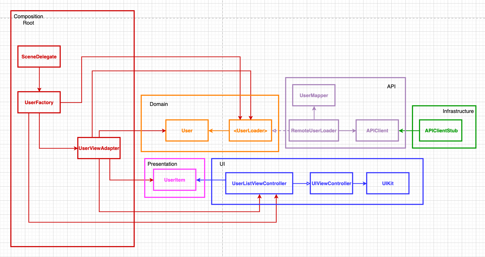

# Architecture Example

## Diagram

Diagram illustrates how we can separate **Core Domain** from API, Presentation and UI. Basically, **Domain** serves as a main layer for any feature (a.k.a business logic that is platform-agnostic).

**API** is in turn business logic that is platform-specific (i.e. it depends on Foundation, but Core Domain does not depend on anything). Note here that `APIClient` lives inside `API` along with `RemoteUserLoader` and `UserMapper` since we do not want to depend on other modules (invert the dependency) and force infrastructure components to be plugged-in.

**Infrastructure** components live at the boundary of the system. It could be URLSession/Alamofire/Any implemention you prefer. Frameworks are just plug-ins and we can easily replace them without affecting the rest of the system.

**Presentation** is used for not letting UI to depend on Domain. Presentation layer is mainly used for separating UI from domain models (models that have identity, i.e. `id` property, but UI does not care about that). Thus, Presentation layer simply includes everything UI needs to render (string text and etc).

**UI** is last piece in the chain and can be swapped easily (since no other layers depend on it). This diagram shows UIKit view controller shown, but the repository includes `UserDetailsView` which is a SwiftUI view. We can easily swap UIKit for SwiftUI without again not affecting the rest of the systme.

**Composition Root** is the most important `glue` part that bridges communication between domain, services and UI. **UserViewAdapter** is solely responsible for mapping `User` models into `UserItem` value objects. Thus, modules stay separated and can be moved to separate frameworks easily if needed. **UserFactory** just composes the entire object graph, while `SceneDelegate` uses the static factory to set push the controller to the navigation stack.